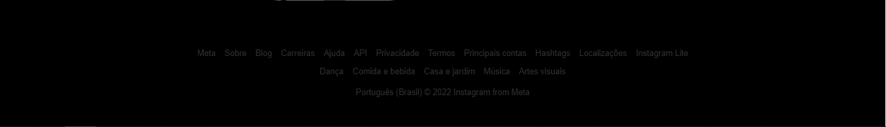

# Projeto tela de login do instagram
 Neste projeto foi desenvolvido a tela de login do instagram com o tema dark
## Resultado 👀
### Tela no desktop:

<h3> Tela mobile:</h3>

<h2>💻 Linguagens que foram utilizadas:</h2>
 
 
 
 

<h2>​👨🏾‍💻 Autor</h2>
Elaborado por Marllon Batista
  

